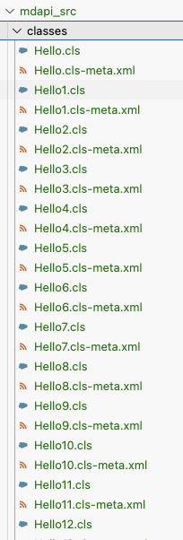

# Testing impact of folders on `sf project deploy `

Create a new scratch org

```
sf org create scratch -a foldertest -f ./config/project-scratch-def.json
```

Clear tracking to ensure all files are pushed

```
sf project delete tracking -p -o foldertest
```

Deploy the project

```
sf project deploy start -c -o  foldertest
```

Notice that there are no errors, even though there are 10205 files + folders in the project. This is above the 10k file limit, indicating that folders are not counted as files.

```
> bash ./count_files_and_folders.sh force-app/*
Number of files:      202
Number of directories:    10003
```

Notice also that unrelated non-source files do not impact the deploy.

Run this script to generate 10000 markdown files in the project.

```
bash ./create_unrelated_files.sh
```

Repeat the steps above, and notice that the deploy is still successful.


# Testing MDAPI format

Convert the deeply nested source format files into MDAPI format.

```
sfdx force:source:convert -d mdapi_src -n "TREX1" -p force-app
```

Notice that the folder structure is flattened in the MDAPI format.

This indicates that folder count in the source format should not impact the 10K file limit when deployed in MDAPI format.


